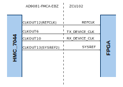
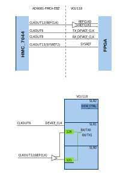

.. _ad9081_fmca_ebz:

AD9081-FMCA-EBZ/AD9082-FMCA-EBZ (Single MxFE) HDL project
===============================================================================

Overview
-------------------------------------------------------------------------------

The :part:`AD9081-FMCA-EBZ <EVAL-AD9081>` / :part:`AD9082-FMCA-EBZ <EVAL-AD9082>`
reference design is a processor based (e.g. Microblaze) embedded system.
The design consists from a receive and a transmit chain.

The receive chain transports the captured samples from ADC to the system
memory (DDR). Before transferring the data to DDR the samples are stored
in a buffer implemented on block rams from the FPGA fabric
(util_adc_fifo). The space allocated in the buffer for each channel
depends on the number of currently active channels. It goes up to M x
64k samples if a single channel is selected or 64k samples per channel
if all channels are selected.

The transmit chain transports samples from the system memory to the DAC
devices. Before streaming out the data to the DAC through the JESD link
the samples first are loaded into a buffer (util_dac_fifo) which will
cyclically stream the samples at the tx_device_clk data rate. The space
allocated in the transmit buffer for each channel depends on the number
of currently active channels. It goes up to M x 64k samples if a single
channel is selected or 64k samples per channel if all channels are
selected.

All cores from the receive and transmit chains are programmable through
an AXI-Lite interface.

The transmit and receive chains can operate at different data rates
having separate rx_device_clk/tx_device_clk and corresponding lane rates
but must share the same reference clock.

Supported devices
-------------------------------------------------------------------------------

-  :part:`AD9081-FMCA-EBZ <EVAL-AD9081>`
-  :part:`AD9082-FMCA-EBZ <EVAL-AD9082>`

Supported carriers
-------------------------------------------------------------------------------

-  For :part:`AD9081-FMCA-EBZ <EVAL-AD9081>`

   -  `A10SoC`_ on FMC V57.1
   -  :xilinx:`VCK190` on FMC0 slot
   -  :xilinx:`VCU118` on FMC+ slot
   -  :xilinx:`VCU128` on FMC+ slot
   -  :xilinx:`ZCU102` on FMC HPC0 slot
   -  :xilinx:`ZC706` on FMC HPC slot

-  For :part:`AD9082-FMCA-EBZ <EVAL-AD9082>`

   -  :xilinx:`VCK190` on FMC0 slot
   -  :xilinx:`VCU118` on FMC+ slot
   -  :xilinx:`ZCU102` on FMC HPC0 slot
   -  :xilinx:`ZC706` on FMC HPC slot

Block design
-------------------------------------------------------------------------------

.. note::

   ``NP`` notation is equivalent with ``N'``

The block design supports configuration of parameters and scales.
We have listed a couple of examples, depending on the configuration used:

The parameters for Rx or Tx links can be changed from the **system_project.tcl**
file, located in hdl/projects/ad9081_fmca_ebz/$CARRIER/system_project.tcl:

Configuration modes
~~~~~~~~~~~~~~~~~~~~~~~~~~~~~~~~~~~~~~~~~~~~~~~~~~~~~~~~~~~~~~~~~~~~~~~~~~~~~~~

.. code-block::

   # Parameter description:
   #    JESD_MODE: used link layer encoder mode:
   #       8B10B  - 8b10b link layer defined in JESD204B
   #       64B66B - 64b66b link layer defined in JESD204C
   #
   #    RX_RATE:  line rate of the Rx link (MxFE to FPGA)
   #    TX_RATE:  line rate of the Tx link (FPGA to MxFE)
   #    [RX/TX]_JESD_M: number of converters per link
   #    [RX/TX]_JESD_L: number of lanes per link
   #    [RX/TX]_JESD_NP: number of bits per sample, only 16 is supported
   #    [RX/TX]_NUM_LINKS  number of links, 1 - single link; 2 - dual link.

   adi_project mxfe_zcu102 0 [list \
       JESD_MODE 8B10B \
       RX_JESD_M 8 \
       RX_JESD_L 4 \
       RX_JESD_S 1 \
       RX_JESD_NP 16 \
       RX_NUM_LINKS 1 \
       TX_JESD_M 8 \
       TX_JESD_L 4 \
       TX_JESD_S 1 \
       TX_JESD_NP 16 \
       TX_NUM_LINKS 1 \
   ]

.. warning::

   For the parameter selection, the following restrictions apply:

   -  NP = 8, 12, 16
   -  F = 1, 2, 3, 4, 6, 8
   -  https://wiki.analog.com/resources/fpga/peripherals/jesd204/axi_jesd204_rx#restrictions
   -  https://wiki.analog.com/resources/fpga/peripherals/jesd204/axi_jesd204_tx#restrictions

Block diagram
~~~~~~~~~~~~~~~~~~~~~~~~~~~~~~~~~~~~~~~~~~~~~~~~~~~~~~~~~~~~~~~~~~~~~~~~~~~~~~~

Example block design for Single link; M=8; L=4
^^^^^^^^^^^^^^^^^^^^^^^^^^^^^^^^^^^^^^^^^^^^^^^^^^^^^^^^^^^^^^^^^^^^^^^^^^^^^^^

.. image:: ../images/ad9081_204b_M8L4.svg
   :width: 800
   :align: center
   :alt: AD9081-FMCA-EBZ JESD204B M=8 L=4 block diagram

The Rx links (ADC Path) operate with the following parameters:

-  Rx Deframer parameters: L=4, M=8, F=4, S=1, NP=16, N=16 (Quick
   Config 0x0A)
-  Sample Rate: 250 MSPS
-  Dual link: No
-  RX_DEVICE_CLK: 250 MHz (Lane Rate/40)
-  REF_CLK: 500MHz (Lane Rate/20)
-  JESD204B Lane Rate: 10Gbps
-  QPLL0 or CPLL

The Tx links (DAC Path) operate with the following parameters:

-  Tx Framer parameters: L=4, M=8, F=4, S=1, NP=16, N=16 (Quick Config
   0x09)
-  Sample Rate: 250 MSPS
-  Dual link: No
-  TX_DEVICE_CLK: 250 MHz (Lane Rate/40)
-  REF_CLK: 500MHz (Lane Rate/20)
-  JESD204B Lane Rate: 10Gbps
-  QPLL0 or CPLL

Example block design for Single link; M=4; L=8
^^^^^^^^^^^^^^^^^^^^^^^^^^^^^^^^^^^^^^^^^^^^^^^^^^^^^^^^^^^^^^^^^^^^^^^^^^^^^^^

.. image:: ../images/ad9081_204b_M4L8.svg
   :width: 800
   :align: center
   :alt: AD9081-FMCA-EBZ JESD204B M=4 L=8 block diagram

The Rx links are set for full bandwidth mode and operate with the
following parameters:

-  Rx Deframer parameters: L=8, M=4, F=1, S=1, NP=16, N=16 (Quick
   Config 0x12)
-  Sample Rate: 1550 MSPS
-  Dual link: No
-  RX_DEVICE_CLK: 387.5 MHz (Lane Rate/40)
-  REF_CLK: 775MHz (Lane Rate/20)
-  JESD204B Lane Rate: 15.5Gbps
-  QPLL0

The Tx links are set for full bandwidth mode and operate with the
following parameters:

-  Tx Framer parameters: L=8, M=4, F=1, S=1, NP=16, N=16 (Quick Config
   0x11)
-  Sample Rate: 1550 MSPS
-  Dual link: No
-  TX_DEVICE_CLK: 387.5 MHz (Lane Rate/40)
-  REF_CLK: 775MHz (Lane Rate/20)
-  JESD204B Lane Rate: 15.5Gbps
-  QPLL0

Example block design for Single link; M=2; L=8; JESD204C
^^^^^^^^^^^^^^^^^^^^^^^^^^^^^^^^^^^^^^^^^^^^^^^^^^^^^^^^^^^^^^^^^^^^^^^^^^^^^^^
.. note::

   In 2019_R2 release, the Xilinx JESD Physical layer IP Core is used,
   however in newer versions it is replaced with ADI's util_adxcvr IP core.

.. image:: ../images/ad9081_204c_M2L8.svg
   :width: 800
   :align: center
   :alt: AD9081-FMCA-EBZ JESD204C M=2 L=8 block diagram

.. warning::

   **Build instructions:**

   The project must be built with the following parameters:

   .. code-block:: bash

      make JESD_MODE=64B66B \
      RX_RATE=16.5 \
      TX_RATE=16.5 \
      RX_JESD_M=2 \
      RX_JESD_L=8 \
      RX_JESD_S=2 \
      RX_JESD_NP=16 \
      TX_JESD_M=2 \
      TX_JESD_L=8 \
      TX_JESD_S=4 \
      TX_JESD_NP=8

The Rx link is operating with the following parameters:

-  Rx Deframer parameters: L=8, M=2, F=1, S=2, NP=16, N=16 (Quick Config
   0x13)
-  Sample Rate: 4000 MSPS
-  Dual link: No
-  RX_DEVICE_CLK: 250 MHz (Lane Rate/66)
-  REF_CLK: 500 MHz (Lane Rate/33)
-  JESD204C Lane Rate: 16.5Gbps
-  QPLL1

The Tx link is operating with the following parameters:

-  Tx Framer parameters: L=8, M=2, F=1, S=4, NP=8, N=8 (Quick Config
   0x13)
-  Sample Rate: 8000 MSPS
-  Dual link: No
-  TX_DEVICE_CLK: 250 MHz (Lane Rate/66)
-  REF_CLK: 500 MHz (Lane Rate/33)
-  JESD204C Lane Rate: 16.5Gbps
-  QPLL1

Clock scheme
~~~~~~~~~~~~~~~~~~~~~~~~~~~~~~~~~~~~~~~~~~~~~~~~~~~~~~~~~~~~~~~~~~~~~~~~~~~~~~~

The clock sources depend on the carrier that is used:

:xilinx:`ZCU102`
^^^^^^^^^^^^^^^^^^^^^^^^^^^^^^^^^^^^^^^^^^^^^^^^^^^^^^^^^^^^^^^^^^^^^^^^^^^^^^^

:xilinx:`VCU118`
^^^^^^^^^^^^^^^^^^^^^^^^^^^^^^^^^^^^^^^^^^^^^^^^^^^^^^^^^^^^^^^^^^^^^^^^^^^^^^^

Description of components
~~~~~~~~~~~~~~~~~~~~~~~~~~~~~~~~~~~~~~~~~~~~~~~~~~~~~~~~~~~~~~~~~~~~~~~~~~~~~~~

Configurations
^^^^^^^^^^^^^^^^^^^^^^^^^^^^^^^^^^^^^^^^^^^^^^^^^^^^^^^^^^^^^^^^^^^^^^^^^^^^^^^

Limitations
^^^^^^^^^^^^^^^^^^^^^^^^^^^^^^^^^^^^^^^^^^^^^^^^^^^^^^^^^^^^^^^^^^^^^^^^^^^^^^^

.. warning::

   For the parameter selection, the following restrictions apply:

   -  NP = 8, 12, 16
   -  F = 1, 2, 3, 4, 6, 8
   -  https://wiki.analog.com/resources/fpga/peripherals/jesd204/axi_jesd204_rx#restrictions
   -  https://wiki.analog.com/resources/fpga/peripherals/jesd204/axi_jesd204_tx#restrictions

IP list
~~~~~~~~~~~~~~~~~~~~~~~~~~~~~~~~~~~~~~~~~~~~~~~~~~~~~~~~~~~~~~~~~~~~~~~~~~~~~~~

-  :git-hdl:`AXI_DMAC <master:library/axi_dmac>`
-  :git-hdl:`UTIL_CPACK2 <master:library/util_pack/util_cpack2>`
-  :git-hdl:`UTIL_UPACK2 <master:library/util_pack/util_upack2>`
-  :git-hdl:`UTIL_ADXCVR <master:library/xilinx/util_adxcvr>`
-  :git-hdl:`AXI_ADXCVR for Intel <master:library/intel/axi_adxcvr>`
-  :git-hdl:`AXI_ADXCVR for Xilinx <master:library/xilinx/axi_adxcvr>`
-  :git-hdl:`AXI_JESD204_RX <master:library/jesd204/axi_jesd204_rx>`
-  :git-hdl:`AXI_JESD204_TX <master:library/jesd204/axi_jesd204_tx>`
-  :git-hdl:`JESD204_TPL_ADC <master:library/jesd204/jesd204_tpl_adc>`
-  :git-hdl:`JESD204_TPL_DAC <master:library/jesd204/jesd204_tpl_dac>`

SPI connections
~~~~~~~~~~~~~~~~~~~~~~~~~~~~~~~~~~~~~~~~~~~~~~~~~~~~~~~~~~~~~~~~~~~~~~~~~~~~~~~

GPIOs
~~~~~~~~~~~~~~~~~~~~~~~~~~~~~~~~~~~~~~~~~~~~~~~~~~~~~~~~~~~~~~~~~~~~~~~~~~~~~~~

CPU/Memory interconnects addresses
~~~~~~~~~~~~~~~~~~~~~~~~~~~~~~~~~~~~~~~~~~~~~~~~~~~~~~~~~~~~~~~~~~~~~~~~~~~~~~~

==================== ================================= ===========
Instance             Depends on parameter              Address
==================== ================================= ===========
axi_mxfe_rx_xcvr     $INTF_CFG!="TX" & $ADI_PHY_SEL==1 0x44A6 0000
rx_mxfe_tpl_core     $INTF_CFG!="TX"                   0x44A1 0000
axi_mxfe_rx_jesd     $INTF_CFG!="TX"                   0x44A9 0000
axi_mxfe_rx_dma      $INTF_CFG!="TX"                   0x7C42 0000
mxfe_rx_data_offload $INTF_CFG!="TX"                   0x7C45 0000
axi_mxfe_tx_xcvr     $INTF_CFG!="RX" & $ADI_PHY_SEL==1 0x44B6 0000
tx_mxfe_tpl_core     $INTF_CFG!="RX"                   0x44B1 0000
axi_mxfe_tx_jesd     $INTF_CFG!="RX"                   0x44B9 0000
axi_mxfe_tx_dma      $INTF_CFG!="RX"                   0x7C43 0000
mxfe_tx_data_offload $INTF_CFG!="RX"                   0x7C44 0000
axi_tdd_0            $TDD_SUPPORT==1                   0x7C46 0000
==================== ================================= ===========

Interrupts
~~~~~~~~~~~~~~~~~~~~~~~~~~~~~~~~~~~~~~~~~~~~~~~~~~~~~~~~~~~~~~~~~~~~~~~~~~~~~~~

Below are the Programmable Logic interrupts used in this project.

================ === ========== =========== ============ =============
Instance name    HDL Linux Zynq Actual Zynq Linux ZynqMP Actual ZynqMP
================ === ========== =========== ============ =============
axi_mxfe_rx_dma  13  57         89          109          141
axi_mxfe_tx_dma  12  56         88          108          140
axi_mxfe_rx_jesd 11  55         87          107          139
axi_mxfe_tx_jesd 10  54         86          106          138
================ === ========== =========== ============ =============

Building the HDL project
-------------------------------------------------------------------------------

Setup guide
-------------------------------------------------------------------------------

Below is a list of user guides which help you start with your setup.

.. warning::

   Before going on to the Quick start guides, please finish reading this page
   as it concerns all carriers.

-  :dokuwiki:`EVAL-AD9081 Arria10 SoC Development Kit Quick Start Guide <resources/eval/user-guides/ad9081/quickstart/a10soc>`
-  :dokuwiki:`AD9081/AD9082 Virtex UltraScale+ VCU118 Quick Start Guide <resources/eval/user-guides/ad9081_fmca_ebz/quickstart/microblaze>`
-  :dokuwiki:`AD9081/AD9082 Versal ACAP VCK190/VMK180 Quick Start Guide <resources/eval/user-guides/ad9081_fmca_ebz/quickstart/versal>`
-  :dokuwiki:`AD9081 Zynq-7000 SoC ZC706 Quick Start Guide <resources/eval/user-guides/ad9081_fmca_ebz/quickstart/zynq>`
-  :dokuwiki:`AD9081/AD9082 Zynq UltraScale+ MPSoC ZCU102 Quick Start Guide <resources/eval/user-guides/ad9081_fmca_ebz/quickstart/zynqmp>`

Connections and hardware changes
~~~~~~~~~~~~~~~~~~~~~~~~~~~~~~~~~~~~~~~~~~~~~~~~~~~~~~~~~~~~~~~~~~~~~~~~~~~~~~~

.. warning::

   **The following hardware changes are required:**

   (**Please note:** In the latest version of the board,
   this is now the default configuraZCU102 FMC HPC0 Slottion, so this configuration step
   **might not be needed anymore**)

   -  In order to avoid using an external clock source and fully rely on
      the HMC7044 clock chip,*\* rotate the C6D/C4D caps in C5D/C3D
      position*\*
   -  If LEDS V1P0_LED and VINT_LED are not on please \*\* depopulate R22M
      and populate R2M*\*

Software considerations
~~~~~~~~~~~~~~~~~~~~~~~~~~~~~~~~~~~~~~~~~~~~~~~~~~~~~~~~~~~~~~~~~~~~~~~~~~~~~~~

ADC - crossbar config
^^^^^^^^^^^^^^^^^^^^^^^^^^^^^^^^^^^^^^^^^^^^^^^^^^^^^^^^^^^^^^^^^^^^^^^^^^^^^^^

Due to physical constraints, Rx lanes are reordered as described in the
following table.

e.g physical lane 2 from ADC connects to logical lane 7
from the FPGA. Therefore the crossbar from the device must be set
accordingly.

============ ===========================
ADC phy Lane FPGA Rx lane / Logical Lane
============ ===========================
0            2
1            0
2            7
3            6
4            5
5            4
6            3
7            1
============ ===========================

DAC - crossbar config
^^^^^^^^^^^^^^^^^^^^^^^^^^^^^^^^^^^^^^^^^^^^^^^^^^^^^^^^^^^^^^^^^^^^^^^^^^^^^^^

Due to physical constraints, Tx lanes are reordered as described in the
following table.

e.g physical lane 2 from DAC connects to logical lane 7
from the FPGA. Therefore the crossbar from the device must be set
accordingly.

============ ===========================
DAC phy lane FPGA Tx lane / Logical lane
============ ===========================
0            0
1            2
2            7
3            6
4            1
5            5
6            4
7            3
============ ===========================

Resources
-------------------------------------------------------------------------------

-  :git-hdl:`ad9081_fmca_ebz HDL project <master:projects/ad9081_fmca_ebz>`
-  :ref:`AXI_DMAC <axi_dmac>`
-  :dokuwiki:`UTIL_CPACK2 (Channel CPACK Utility Core) <resources/fpga/docs/util_cpack>`
-  :dokuwiki:`UTIL_UPACK2 (Channel UNPACK Utility Core) <resources/fpga/docs/util_upack>`
-  :dokuwiki:`UTIL_ADXCVR core for Xilinx devices <resources/fpga/docs/util_xcvr>`
-  :dokuwiki:`AXI_ADXCVR <resources/fpga/docs/axi_adxcvr>`
-  :dokuwiki:`AXI_JESD204_RX (JESD204B/C Link Receive Peripheral) <resources/fpga/peripherals/jesd204/axi_jesd204_rx>`
-  :dokuwiki:`AXI_JESD204_TX (JESD204B/C Link Transmit Peripheral) <resources/fpga/peripherals/jesd204/axi_jesd204_tx>`
-  :dokuwiki:`JESD204_TPL_ADC (ADC JESD204B/C Transport Peripheral) <resources/fpga/peripherals/jesd204/jesd204_tpl_adc>`
-  :dokuwiki:`JESD204_TPL_DAC (DAC JESD204B/C Transport Peripheral) <resources/fpga/peripherals/jesd204/jesd204_tpl_dac>`
-  :dokuwiki:`AD9081-FMCA-EBZ Linux driver wiki page <resources/tools-software/linux-drivers/iio-mxfe/ad9081>`

More information
-------------------------------------------------------------------------------

-  :ref:`ADI HDL User guide <user_guide>`
-  :ref:`ADI HDL project architecture <architecture>`
-  :ref:`ADI HDL project build guide <build_hdl>`
-  :dokuwiki:`Generic JESD204B block designs <resources/fpga/docs/hdl/generic_jesd_bds>`
-  :dokuwiki:`JESD204B High-Speed Serial Interface Support <resources/fpga/peripherals/jesd204>`

\**\* THIS IS JUST AN EXAMPLE \**\*

-  :dokuwiki:`EVALUATING THE AD9695/AD9697 ANALOG-TO-DIGITAL
   CONVERTER <resources/eval/ad9695-1300ebz>`
-  :dokuwiki:`AD-SYNCHRONA14-EBZ <resources/eval/user-guides/ad-synchrona14-ebz>`
-  :dokuwiki:`Generic JESD204B block
   designs <resources/fpga/docs/hdl/generic_jesd_bds>`
-  :dokuwiki:`JESD204B High-Speed Serial Interface
   Support <resources/fpga/peripherals/jesd204>`
-  :dokuwiki:`AXI_PWM_GEN <resources/fpga/docs/axi_pwm_gen>` wiki documentation
-  :dokuwiki:`AXI_CLKGEN <resources/fpga/docs/axi_clkgen>` wiki documentation
-  :dokuwiki:`High-Speed DMA Controller
   Peripheral <resources/fpga/docs/axi_dmac>` wiki documentation
-  :dokuwiki:`UTIL_CPACK2 <resources/fpga/docs/util_cpack2>` wiki documentation
-  :dokuwiki:`UTIL_UPACK2 <resources/fpga/docs/util_upack2>` wiki documentation
-  :dokuwiki:`How to prepare an SD
   card <resources/tools-software/linux-software/kuiper-linux>` with
   boot files
-  :dokuwiki:`ADI reference designs HDL user guide <resources/fpga/docs/hdl>`
-  :dokuwiki:`ADI HDL architecture <resources/fpga/docs/arch>` wiki page
-  :dokuwiki:`How to build an ADI HDL project <resources/fpga/docs/build>`
-  :ref:`ADI HDL User guide <user_guide>`
-  :ref:`ADI HDL project architecture <architecture>`
-  :ref:`ADI HDL project build guide <build_hdl>`

-  :dokuwiki:`AD9081 Quick Start
   Guides <resources/eval/user-guides/ad9081_fmca_ebz/quickstart>`
-  :dokuwiki:`Building HDL <resources/fpga/docs/build>`
-  :dokuwiki:`AD-FMC-SDCARD for Zynq & Altera SoC Quick Start
   Guide <resources/tools-software/linux-software/kuiper-linux>`

Support
-------------------------------------------------------------------------------

Analog Devices will provide **limited** online support for anyone using
the reference design with Analog Devices components via the
:ez:`fpga` FPGA reference designs forum.

It should be noted, that the older the tools' versions and release
branches are, the lower the chances to receive support from ADI
engineers.

.. _A10SoC: https://www.intel.com/content/www/us/en/products/details/fpga/development-kits/arria/10-sx.html
